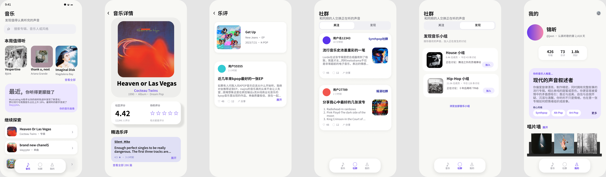

<div align="center">

# 🎧 Musicating

### 音乐发现 · 中文乐评 · 兴趣社群 · AI 音乐人格

[](#ai-音乐人格)
[](https://musicating.ilacey.com/)
[](https://musicating.ilacey.com/)

<a href="https://musicating.ilacey.com/"><strong>🌐 在线体验</strong></a>
&nbsp; · &nbsp;
<a href="./PRD.md"><strong>完整 PRD</strong></a>
&nbsp; · &nbsp;
<a href="./PRD-LITE.md"><strong>MVP PRD Lite</strong></a>

</div>

<br />



## 项目简介

Musicating 是一个独立的音乐发现与中文乐评社交 Web 产品。用户可以搜索艺人、专辑和单曲，在作品页评分或写乐评；也可以通过乐评速递、小组和个人主页阅读观点、寻找同好。

Spotify API 用于提供音乐目录、榜单和用户主动授权的听歌数据。评分、乐评、社交互动与 AI 分析均发生在 Musicating 内；产品不提供音乐播放、歌词或版权内容分发。

> 这个仓库只公开产品材料与界面展示，不包含应用源代码、服务端配置、数据库迁移或密钥。

## 用户路径

```text
🔎 搜索或浏览榜单
      ↓
💿 打开作品详情，阅读资料与乐评
      ↓
✍️ 评分 / 发布乐评
      ↓
👥 进入小组、回复或关注作者
      ↓
✨ 回看个人音乐档案与 AI 音乐人格
```

## MVP 已实现功能

| 模块 | 交付内容 |
| --- | --- |
| 🔎 发现与搜索 | 艺人、专辑、单曲搜索；日榜/周榜；艺人和作品详情；关联对象跳转 |
| ✍️ 评分与乐评 | 0.5–5 星评分；200 字以上乐评；编辑删除；点赞与一级回应 |
| 📰 乐评速递 | 最新公开乐评卡片、作品信息、正文摘要与“搜索想评价的音乐”入口 |
| 👥 兴趣社群 | 创建/加入小组、讨论、活动、成员主页与帖子详情 |
| 🙋 个人档案 | 资料、关注关系、评分/乐评记录、唱片墙与 Spotify 偏好 |
| 🔔 消息通知 | 新关注和他人回复自己小组帖子时显示未读提示 |
| ✨ AI 音乐人格 | 基于评分、乐评及授权听歌数据生成可解释的音乐取向卡片 |

## AI 音乐人格

AI 音乐人格用于帮助用户理解自己的音乐取向。它既服务于想整理审美档案的深度听众，也服务于尚未形成稳定流派认知、希望从自身行为开始探索音乐的用户。

```text
站内评分与乐评 + 用户授权的 Spotify 数据
                    ↓
后端统计：挑剔指数、单曲执念、流派探索、鉴赏输出
                    ↓
识别流派广度、流派深度、主听流派与代表作品
                    ↓
DeepSeek 根据结构化结果生成称号、技能、签名和说明
                    ↓
JSON 校验、缓存、前端展示
```

- 数值和代表作品由程序计算，模型只生成解释性文案；
- 不向模型发送密钥，不编造播放记录、评分或乐评原话；
- 数据不足或外部服务异常时，产品显示可重试状态，而不是伪造个性化结论。

## 文档导航

| 文档 | 内容 |
| --- | --- |
| [PRD.md](./PRD.md) | 产品问题、用户分层、核心功能、AI 方案、验证方法和后续优先级 |
| [PRD-LITE.md](./PRD-LITE.md) | 当前 MVP 的范围、已实现能力、边界和验证重点 |

## 当前边界与下一步

MVP 当前不提供音乐播放、私信/群聊、付费订阅、复杂推荐算法、通用 AI 问答或 RAG。

下一阶段优先完善服务稳定性、内容治理、乐评与帖子分享、AI 卡片反馈；个人音乐 RAG 问答仅会在用户明确授权和检索质量可控后评估。

---

<div align="center">

<a href="https://musicating.ilacey.com/">访问 Musicating ↗</a>

</div>
